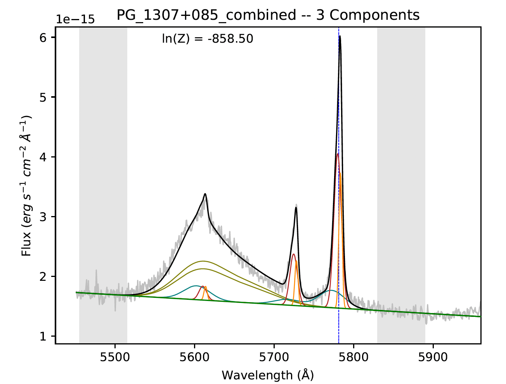

Keeping the BEAT
================
The Bayesian Evidence Analysis Tool (BEAT) is a Python-based code for measuring and dissecting
multi-component emission lines frequently observed in active galactic nuclei (AGN) exhibiting
outflowing winds. BEAT was designed to analyze large numbers of spectra (i.e. large surveys or IFU
spectroscopy) automatically and determine the number of physical kinematic components in a given set
of emission lines.

For further information, see the BEAT documentation at
`keeping-the-beat.readthedocs.io <https://keeping-the-beat.readthedocs.io>`_.

**Getting Started**

how to install and get going...

