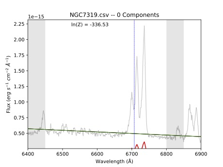
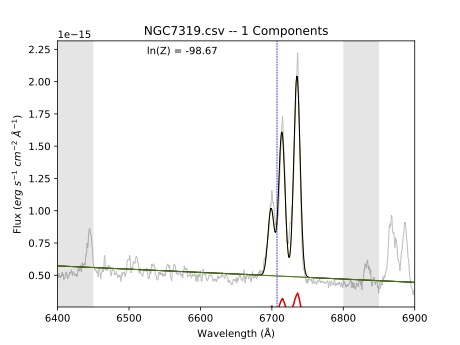
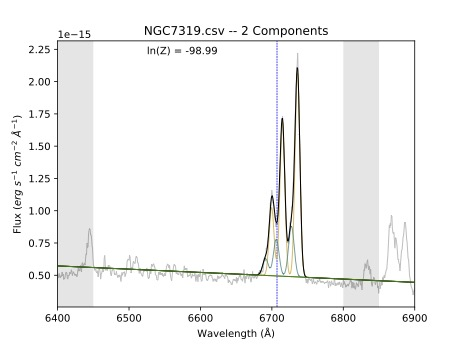

Installation
===============

MacOS Systems
-------------
*Written by: Dzhuliya Dashtamirova*

For the time being you should clone the BEAT repository from our
`Github page <https://github.com/dzhuliya/keeping-the-BEAT>`_.

.. code::

    git clone https://github.com/dzhuliya/keeping-the-BEAT.git

You will also need to have MultiNest/PyMultiNest installed on your machine.
If you do not have MultiNest installed, follow the instructions found
`here under "on your own computer" <http://johannesbuchner.github.io/pymultinest-tutorial/install.html>`_.
If you are on MacOS, we recommend following the instructions found
`here <https://www.astrobetter.com/wiki/MultiNest+Installation+Notes>`_.

If you run into issues installing PyMultiNest with pip install, try:

.. code::

    conda install -c conda-forge pymultinest

In our experience, the following instructions worked on a Mac:

#. Install both Xcode and the Xcode Command Line Tools

#. Install Macports
    * Set up Macports to `sync via git <https://trac.macports.org/wiki/howto/SyncingWithGit>`_ instead of rsync
    * Use the  `Astrobetter <https://www.astrobetter.com/wiki/MultiNest+Installation+Notes>`_
      website guide to install gcc5, cmake and openmpi. If you have issues with installing
      openmpi via sudo port install openmpi, then try installing with brew.
    * Set correct version of gcc and mpi within Macports.  Refer to this website if you have trouble:
      https://stackoverflow.com/questions/8361002/how-to-use-the-gcc-installed-in-macports
      **Note:**  Make certain the the PATH of the user is set such that the Macports version of gfortran
      is seen as the default gfortran compiler.  Other gfortran compilers will fail.

#. Install anaconda and astroconda. Activate the astroconda environment.

#. Use pip to install mpi4py

#. Download Multinest

.. code::

    git clone https://github.com/JohannesBuchner/MultiNest.git
    cd MultiNest/build/
    cmake ..
    make
    sudo make install

6. Download PyMultiNest

.. code::

    git clone https://github.com/JohannesBuchner/PyMultiNest.git
    cd PyMultiNest
    python setup.py install

7. You can test your MultiNest installation following the instructions also listed on `Astrobetter <https://www.astrobetter.com/wiki/MultiNest+Installation+Notes>`_

Simple example fit
------------------
*Written by: Julia Falcone*

Let's test that BEAT is correctly installed and working properly on your machine. From the top level of the ``keeping-the-BEAT`` repository, navigate to the ``BEAT example fit`` directory and open the ``BEAT example notebook.ipynb`` Jupyter notebook. If you run all cells in this notebook without changing anything, it will take the single spectrum in the ``spectrum`` folder (taken from long-slit observations NGC 7319) and fit it.

It will create a new directory in the current location called ``ngc7319_out,`` which stores the results of the fit. It should produce three PDF files in the ``plots`` folder, which should look like the plots below:

